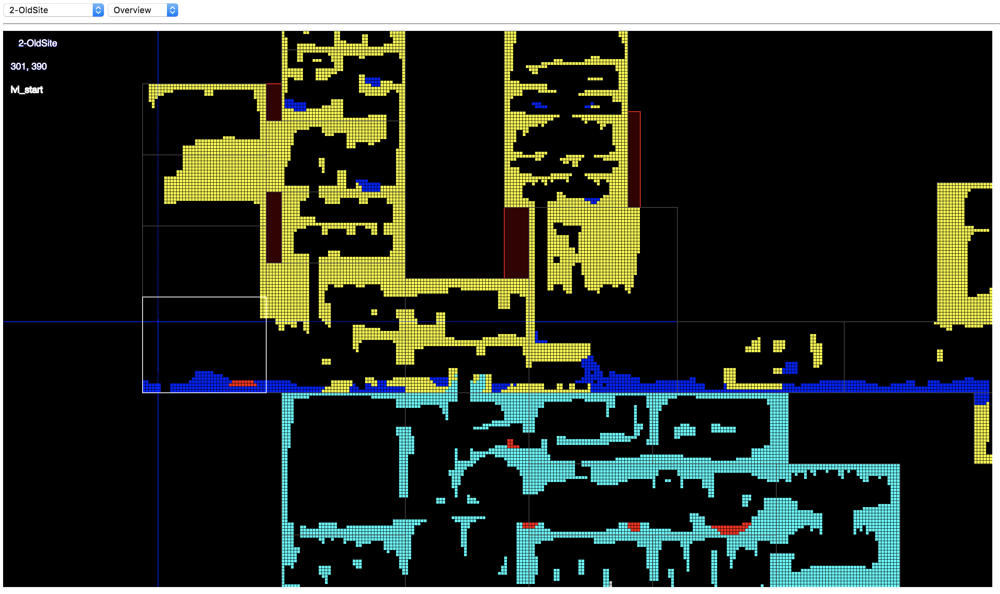
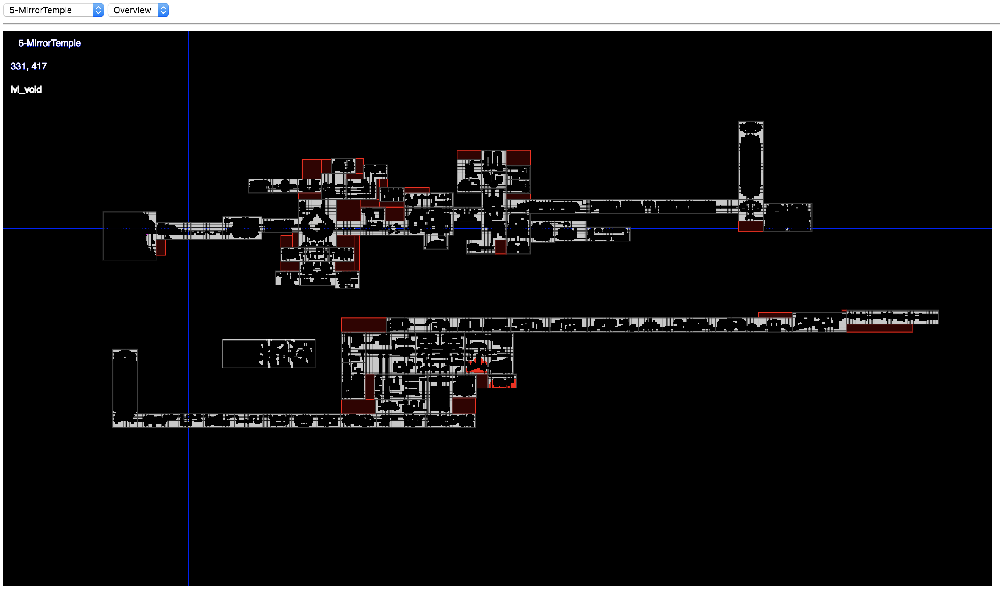
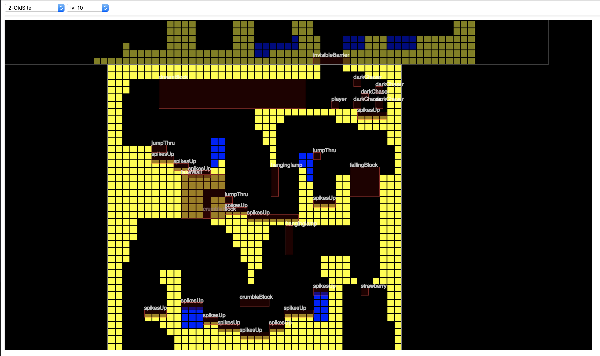
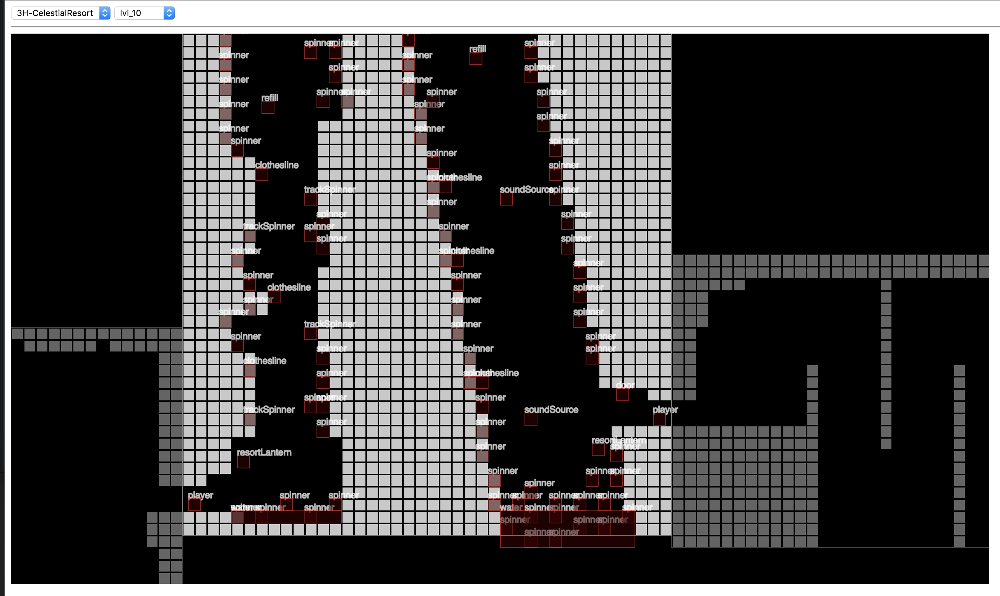

# Celeste Reverse Engineering

In the interest of sharing (which I wish I had done more of in my early ROM hacking days), I'm putting up my code/findings here in case anyone may find it useful. I might clean it up later, make things easier to use, more tools, documentation, but I don't have any real goals here.

There is already a whole Celeste modding community out there who have already done a lot and have formal tools. I just love the challenge of seeing what I can do from scratch!

**Disclaimer**: This was done very quickly (most of a Saturday) and without reference resources so it is very, very rough.

## Map/level viewer demo

Learning through visualizations is fun. Lately, I've been playing around with [p5.js](https://p5js.org/) as a quick and dirty web drawing tool. It made sense to try putting these two things together so I made a quick level viewer. [You can see it in action here](https://codepen.io/deltabouche/pen/WJPbaQ).

I only included the first two maps in the interest of not giving away the entire game's map data away. However, if the devs would rather I not put those two maps up I will happily take down the Codepen demo until I add a way to load .bin files locally. The viewer code is in this repository as well.

Each map starts off with the Overview (like what you see in debug mode), which shows all the levels stitched together. Arrow keys move around the map, Q/A control zoom.

If you right click on a level it takes you to the level view, where you will also see the various entities in that level. It's neat to put a name on the various things in the game! Arrow keys also move around in this view. You can right click adjoining areas to enter them. Esc will take you back to the overview.

For this, I took the levels and used `map2json.rb` to convert them into JSON for easier JS manipulation and wrote a viewer in p5.js. Here's an [example](http://deltabouche.com/celeste/json/0-Intro.json) of what one of these looks like, which again might get taken down if requested.

# Tools used

* Turning on debug mode on Celeste and poking around. (Done by editing your save file and enabling the flag)
* [010 Hex Editor](https://www.sweetscape.com/010editor/) for poking in the .bin
* The `rom.rb` and `binwriter.rb` files that I've built up over the past few years for quick ROM Hacking / reverse engineering projects.
* [ILSpy .NET Decompiler Visual Code extension](https://marketplace.visualstudio.com/items?itemName=icsharpcode.ilspy-vscode) - when I realized this was a kind of tree structure I started digging into code. This was most useful for looking at `BinaryPacker` for the map files, and in general getting a feel for how things are structured. `AreaData` is a good birds eye view of all map data.
* [Codepen](https://codepen.io/) for quick JS sketches.
